# YouSuckAtMath.com: Product Requirements Document

## Executive Summary

YouSuckAtMath.com aims to revolutionize mathematics education by providing an AI-powered platform that extends beyond the K-12 level offered by platforms like Khan Academy. The platform will support college-level math courses through a comprehensive collection of catalogued textbooks and customized learning paths.

## Vision & Mission

**Vision**: To democratize access to advanced mathematics education by leveraging AI technology to provide personalized learning experiences.

**Mission**: Create an open-source, free platform that helps users overcome mathematical challenges through AI-assisted learning, comprehensive textbook integration, and customizable learning paths.

## Problem Statement

Current online mathematics education platforms have several limitations:
- Most platforms like Khan Academy only cover K-12 level mathematics
- They use a singular learning progression model that may not accommodate diverse learning styles
- Limited support for college-level courses and specialized mathematical fields
- Lack of integration with existing textbooks and course materials
- No personalized guidance based on individual learning patterns and challenges

## Solution Overview

YouSuckAtMath.com addresses these limitations through:
1. An open-source, free platform with built-in AI assistance
2. Support for a wide range of catalogued textbooks and college-level courses
3. Automated textbook crawling and cataloguing system
4. Context-aware retrieval system using graph RAG databases for each textbook
5. Customizable learning paths for various college concentrations
6. Personalized AI tutoring that adapts to individual learning styles and challenges

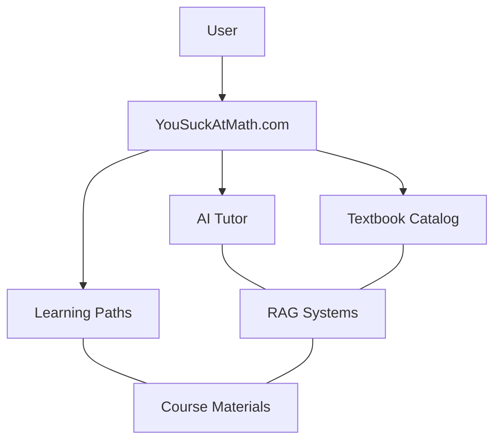

This document outlines the complete requirements, architecture, and development guidelines for building YouSuckAtMath.com from the perspectives of a Software Architect, Software Developer, and Product Manager.

## 1. Software Architecture Perspective

### 1.1 System Architecture Overview

YouSuckAtMath.com will be built using a modern, scalable, and maintainable architecture that enables efficient data processing, AI integration, and user experience delivery.

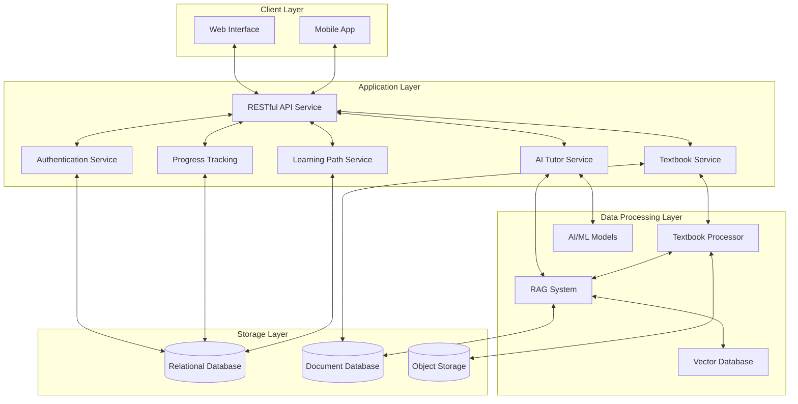

### 1.2 Component Descriptions

#### 1.2.1 Client Layer
- **Web Interface**: Progressive Web App (PWA) built with modern JavaScript framework
- **Mobile App**: Native or hybrid mobile application for iOS and Android

#### 1.2.2 Application Layer
- **RESTful API Service**: Core backend service that handles client requests
- **Authentication Service**: Manages user authentication and authorization
- **AI Tutor Service**: Provides AI-powered tutoring and assistance
- **Textbook Service**: Manages textbook metadata, content access, and search
- **Learning Path Service**: Configures and delivers customized learning paths
- **Progress Tracking**: Records and analyzes user learning progress

#### 1.2.3 Data Processing Layer
- **Textbook Processor**: Crawls, parses, and indexes textbook content
- **RAG System**: Retrieval-Augmented Generation system for contextual AI responses
- **Vector Database**: Stores vectorized textbook content for semantic search
- **AI/ML Models**: Large Language Models and other AI systems for tutoring

#### 1.2.4 Storage Layer
- **Relational Database**: Stores structured data (user profiles, progress, etc.)
- **Document Database**: Stores semi-structured data (textbook content, questions, etc.)
- **Object Storage**: Stores binary files (images, PDFs, etc.)

### 1.3 Data Model

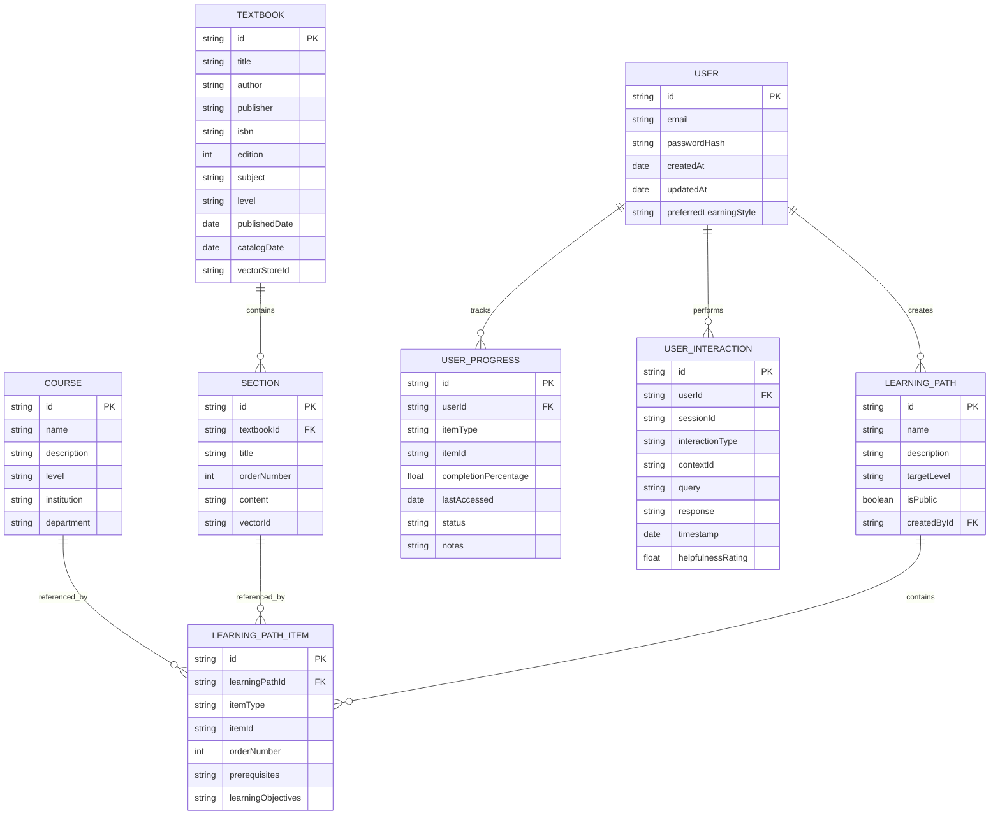

### 1.4 API Design

The platform will use a RESTful API design with the following major endpoints:

#### Authentication API
- `POST /api/auth/register`
- `POST /api/auth/login`
- `POST /api/auth/refresh`
- `POST /api/auth/logout`

#### User API
- `GET /api/users/{id}`
- `PUT /api/users/{id}`
- `GET /api/users/{id}/progress`
- `GET /api/users/{id}/interactions`

#### Textbook API
- `GET /api/textbooks`
- `GET /api/textbooks/{id}`
- `GET /api/textbooks/{id}/sections`
- `POST /api/textbooks` (admin)
- `POST /api/textbooks/process` (admin)

#### Learning Path API
- `GET /api/learning-paths`
- `GET /api/learning-paths/{id}`
- `POST /api/learning-paths`
- `PUT /api/learning-paths/{id}`
- `DELETE /api/learning-paths/{id}`
- `GET /api/learning-paths/{id}/items`

#### AI Tutor API
- `POST /api/tutor/question`
- `POST /api/tutor/explain`
- `POST /api/tutor/solve`
- `POST /api/tutor/chat`
- `GET /api/tutor/history`

### 1.5 Security Architecture

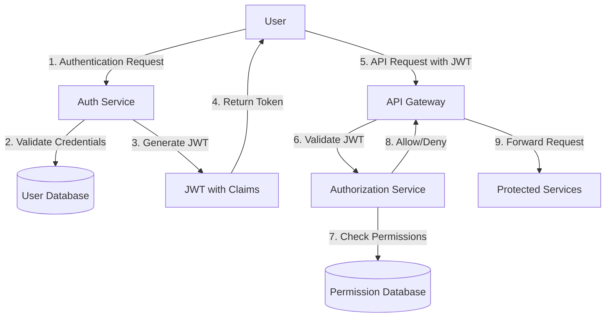

Security features include:
- JWT-based authentication
- Role-based access control (RBAC)
- Data encryption at rest and in transit
- API rate limiting
- OAuth 2.0 support for third-party integrations
- GDPR and COPPA compliance measures
- Regular security audits and penetration testing

## 2. Software Developer Perspective

### 2.1 Technology Stack

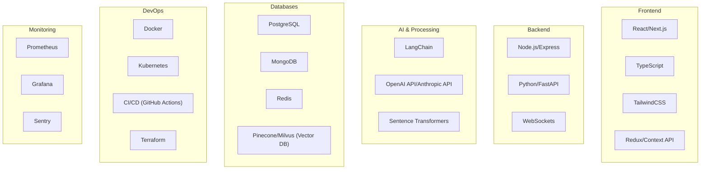

### 2.2 Code Organization & Best Practices

#### 2.2.1 Project Structure

```
yousuckatmath/
├── client/                # Frontend application
│   ├── public/           # Static assets
│   ├── src/
│   │   ├── components/   # Reusable UI components
│   │   ├── pages/        # Route-based components
│   │   ├── hooks/        # Custom React hooks
│   │   ├── services/     # API service clients
│   │   ├── store/        # State management
│   │   ├── styles/       # Global styles
│   │   ├── utils/        # Helper functions
│   │   └── types/        # TypeScript type definitions
├── server/               # Backend services
│   ├── api/              # RESTful API endpoints
│   ├── auth/             # Authentication service
│   ├── textbook/         # Textbook processing service
│   ├── tutor/            # AI tutoring service
│   ├── learning-path/    # Learning path service
│   └── common/           # Shared utilities and models
├── ai/                   # AI components
│   ├── models/           # AI model adapters
│   ├── rag/              # RAG system implementation
│   ├── vectorstore/      # Vector database integration
│   └── prompts/          # Prompt templates
├── docs/                 # Documentation
├── scripts/              # Utility scripts
├── tests/                # Test suites
└── infrastructure/       # IaC and deployment configs
```

#### 2.2.2 Coding Standards

- **Code Style**: Consistent formatting using ESLint/Prettier for JavaScript/TypeScript and Black/isort for Python
- **Documentation**: JSDoc for JavaScript/TypeScript and docstrings for Python
- **Testing**: Unit tests with Jest for frontend, Pytest for Python backend
- **Code Reviews**: Required for all PRs with at least one approving review
- **Commit Messages**: Follow the Conventional Commits standard

#### 2.2.3 Development Workflow

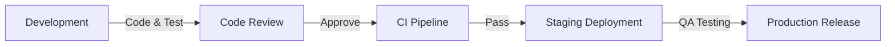

### 2.3 AI Integration Framework

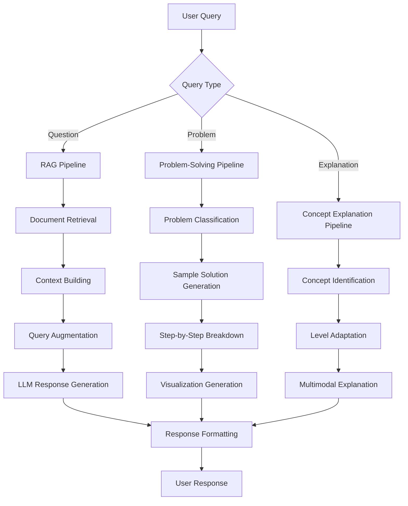

### 2.4 Textbook Processing Pipeline

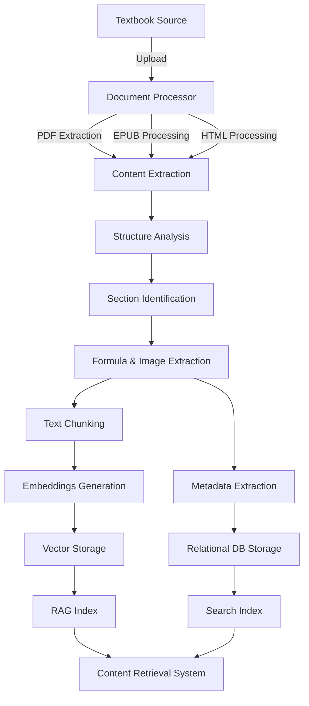

### 2.5 Testing Strategy

#### 2.5.1 Testing Pyramid

```mermaid
pyramid-schema
    title Testing Strategy
    E2E Tests: 10%
    Integration Tests: 30%
    Unit Tests: 60%
```

#### 2.5.2 Testing Types

1. **Unit Tests**:
   - Component tests for frontend
   - Function/class tests for backend
   - AI model adapter tests

2. **Integration Tests**:
   - API endpoint tests
   - Database interaction tests
   - Service communication tests

3. **End-to-End Tests**:
   - User flow tests
   - UI/UX tests
   - Performance tests

4. **Specialized AI Testing**:
   - RAG retrieval accuracy tests
   - LLM response quality tests
   - Prompt injection security tests

### 2.6 Monitoring & Logging

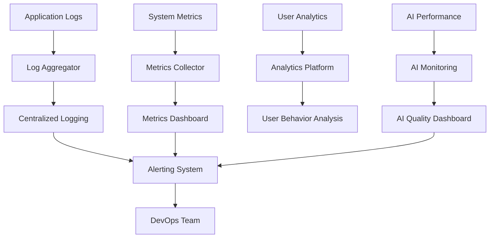

### 2.7 Security Implementation

1. **Authentication**:
   - JWT implementation with proper expiration and refresh mechanism
   - Secure password storage with bcrypt
   - MFA support

2. **Data Protection**:
   - Encryption at rest using AES-256
   - TLS 1.3 for all traffic
   - API request/response sanitization

3. **Access Control**:
   - RBAC implementation
   - Fine-grained permissions
   - API rate limiting and throttling

4. **Security Testing**:
   - Regular penetration testing
   - Dependency vulnerability scanning
   - OWASP Top 10 compliance checks

### 2.8 Deployment Architecture

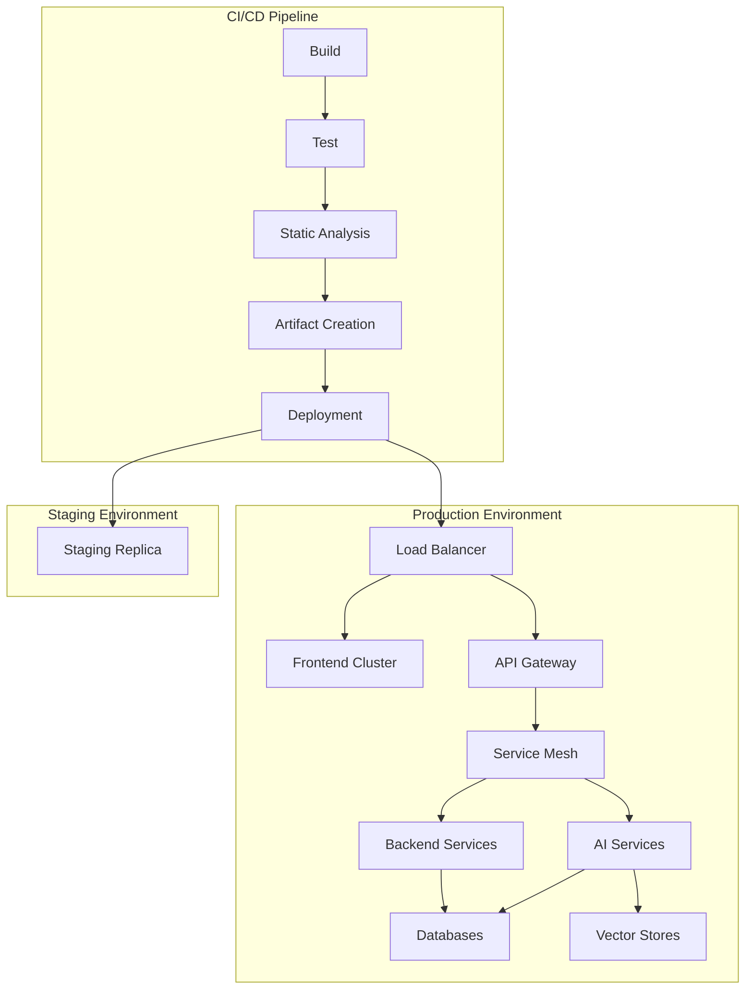

### 2.9 Third-party Integrations

1. **AI Service Providers**:
   - OpenAI API
   - Anthropic Claude
   - Hugging Face

2. **Authentication Providers**:
   - Auth0
   - Firebase Authentication
   - Social login providers

3. **Analytics & Monitoring**:
   - Google Analytics
   - Sentry
   - DataDog

4. **Infrastructure**:
   - AWS/Azure/GCP
   - Cloudflare
   - GitHub

## 3. Product Manager Perspective

### 3.1 User Personas

#### 3.1.1 College Student - "Struggling Sam"
- **Background**: Undergraduate student taking required math courses
- **Pain Points**: Difficulty understanding abstract concepts, limited access to tutoring
- **Goals**: Pass courses, build foundational understanding, prepare for exams
- **Usage Patterns**: Intense usage before exams, regular homework assistance

#### 3.1.2 Self-Learner - "Curious Carol"
- **Background**: Working professional looking to expand knowledge
- **Pain Points**: No structured learning path, difficulty finding appropriate resources
- **Goals**: Master new mathematical concepts for career advancement or personal interest
- **Usage Patterns**: Regular, self-paced learning sessions in specific areas of interest

#### 3.1.3 Educator - "Teaching Tom"
- **Background**: Math professor or teaching assistant
- **Pain Points**: Limited resources for creating assignments, difficulty tracking student progress
- **Goals**: Provide better resources to students, recommend personalized learning paths
- **Usage Patterns**: Creating custom learning paths, monitoring student engagement

### 3.2 User Journey Maps

#### 3.2.1 New User Onboarding

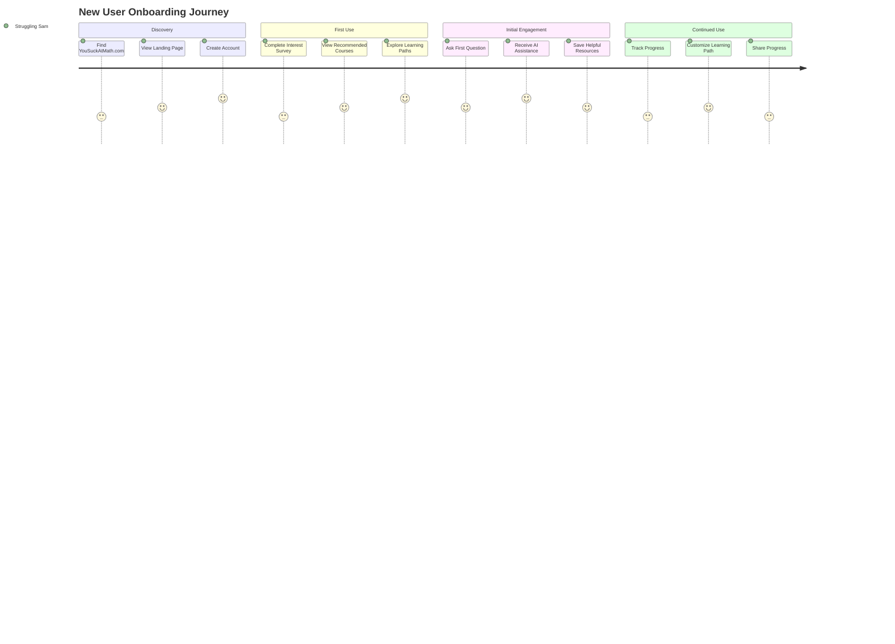

#### 3.2.2 Problem-Solving Flow

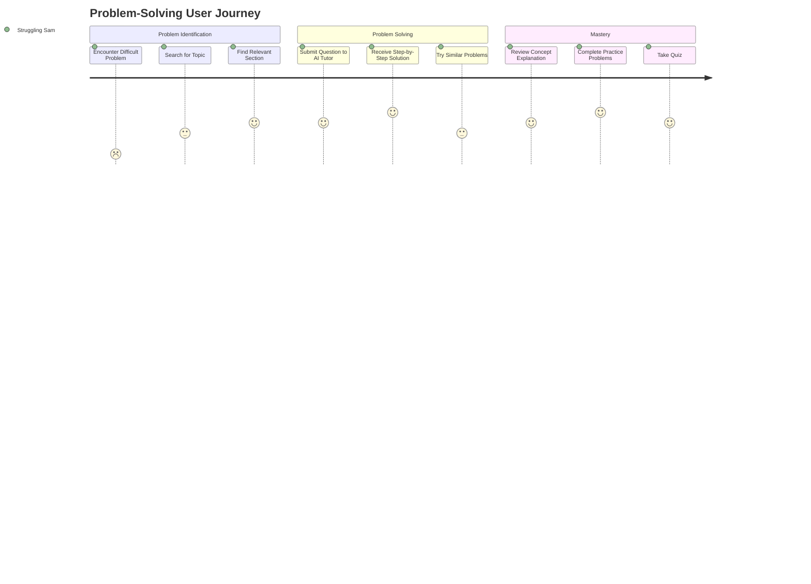

### 3.3 Feature Set

#### 3.3.1 Core Features

1. **AI Tutor**
   - Natural language question answering
   - Step-by-step problem solving
   - Conceptual explanations with examples
   - Formula recognition and explanation
   - Personalized learning recommendations

2. **Textbook Integration**
   - Searchable textbook catalog
   - Section-by-section navigation
   - Formula and diagram extraction
   - Interactive practice problems
   - Supplementary resources

3. **Learning Paths**
   - Pre-defined paths for common courses
   - Custom path creation
   - Progress tracking
   - Prerequisite recommendations
   - Adaptive difficulty levels

4. **User Dashboard**
   - Learning progress visualization
   - Recently accessed materials
   - Saved problems and solutions
   - Personalized recommendations
   - Study streak and achievements

#### 3.3.2 Feature Prioritization Matrix

| Feature | Impact | Effort | Priority |
|---------|--------|--------|----------|
| AI Tutor - Basic Q&A | High | Medium | P0 |
| AI Tutor - Step-by-Step Solutions | High | High | P0 |
| Textbook Search | High | Medium | P0 |
| User Accounts | Medium | Low | P0 |
| Basic Learning Paths | Medium | Medium | P1 |
| Progress Tracking | Medium | Medium | P1 |
| Custom Learning Paths | Medium | High | P2 |
| Social Features | Low | Medium | P3 |
| Mobile App | Medium | High | P2 |
| Advanced Analytics | Low | High | P3 |

### 3.4 User Stories

#### 3.4.1 AI Tutor

```
As a college student
I want to ask questions about calculus concepts
So that I can understand the material for my upcoming exam

Acceptance Criteria:
- Can ask questions in natural language
- Receive clear, concise explanations
- See relevant formulas and diagrams
- Get examples that illustrate the concept
- Have option for simpler or more advanced explanations
```

```
As a self-learner
I want to upload a math problem and get a step-by-step solution
So that I can learn how to solve similar problems

Acceptance Criteria:
- Can upload image of handwritten or typed problem
- Receive accurate recognition of the problem
- Get detailed step-by-step solution
- See explanations for each step
- Have option to try similar problems for practice
```

#### 3.4.2 Textbook Integration

```
As a student
I want to search across multiple textbooks for a specific concept
So that I can find the best explanation for my learning style

Acceptance Criteria:
- Can search by concept, keyword, or formula
- See results from multiple textbooks
- Filter results by difficulty level or approach
- Access relevant sections without purchasing textbooks
- Save favorite explanations for later reference
```

```
As an educator
I want to create a custom textbook collection for my course
So that I can provide the best resources to my students

Acceptance Criteria:
- Can select specific sections from multiple textbooks
- Arrange sections in custom order
- Add personal notes and explanations
- Share collection with students via link
- Track which sections students access most frequently
```

#### 3.4.3 Learning Paths

```
As a new user
I want recommendations for learning paths based on my goals
So that I can efficiently learn the math I need

Acceptance Criteria:
- Complete survey about goals and background
- Receive personalized learning path recommendations
- See estimated completion time for each path
- View prerequisites for advanced topics
- Easily enroll in recommended paths
```

```
As a continuing learner
I want to track my progress through a learning path
So that I can stay motivated and focused

Acceptance Criteria:
- See visual progress indicators
- Receive completion certificates for sections
- Get encouraging notifications for milestones
- View statistics on time spent and problems solved
- Receive recommendations for next steps
```

### 3.5 User Interface Design

#### 3.5.1 Key Screens

1. **Home Dashboard**
   - Personalized welcome and progress summary
   - Continue learning section (recently accessed materials)
   - Recommended next topics
   - Quick access to AI tutor
   - Achievements and milestones

2. **AI Tutor Interface**
   - Question input area (text and image upload)
   - Chat-like interaction history
   - Formula rendering
   - Drawing tools for mathematical notation
   - Related concepts sidebar

3. **Textbook Browser**
   - Search and filter controls
   - Textbook cards with preview information
   - Table of contents navigation
   - Split view for comparing multiple sources
   - Save and bookmark functionality

4. **Learning Path View**
   - Visual path representation with progress indicators
   - Section details and prerequisites
   - Estimated time commitments
   - Related textbook sections
   - Practice problem sets

#### 3.5.2 Information Architecture

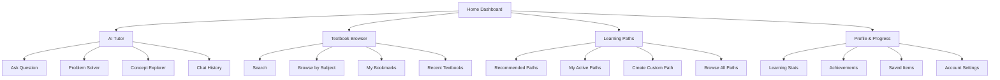

### 3.6 Accessibility Considerations

1. **Visual Accessibility**
   - High contrast mode
   - Adjustable text size
   - Screen reader compatibility
   - Alt text for all images and diagrams
   - Keyboard navigation

2. **Learning Accessibility**
   - Multiple explanation styles for different learning types
   - Audio explanations of visual concepts
   - Simplified language option
   - Reduced cognitive load layouts
   - Progress at your own pace

3. **Technical Accessibility**
   - Offline mode for core content
   - Low bandwidth option
   - Mobile-responsive design
   - Cross-browser compatibility
   - Progressive enhancement

### 3.7 Analytics and Success Metrics

#### 3.7.1 Key Performance Indicators (KPIs)

| Metric | Description | Target |
|--------|-------------|--------|
| Monthly Active Users | Users who engage with platform at least once per month | 100K+ after 1 year |
| User Retention | Percentage of users who return after 1 month | >60% |
| Problem Resolution Rate | Percentage of questions that users mark as resolved | >80% |
| Learning Path Completion | Percentage of started paths that reach completion | >40% |
| User Satisfaction | Average rating from user feedback surveys | >4.5/5 |
| Time to First Value | Time from signup to first successful problem solution | <5 minutes |

#### 3.7.2 Analytics Implementation

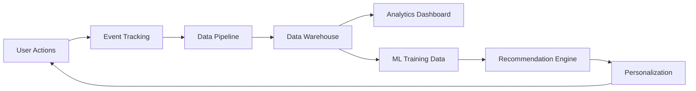

### 3.8 Monetization Strategy (Future Considerations)

While keeping the core platform free and open-source, potential future monetization could include:

1. **Premium Features**
   - Advanced problem-solving capabilities
   - Unlimited AI tutor sessions
   - Priority support

2. **Institutional Licenses**
   - School and university partnerships
   - Custom branded instances
   - Integration with existing LMS

3. **Content Partnerships**
   - Textbook publisher collaborations
   - Premium content integration
   - Revenue sharing model

### 3.9 Implementation Roadmap

#### 3.9.1 Phase 1: MVP (3 months)
- Basic user accounts and profiles
- AI tutor with question answering capabilities
- Limited textbook catalog (10-20 popular textbooks)
- Simple learning paths for core subjects
- Web-based interface

#### 3.9.2 Phase 2: Core Platform (6 months)
- Expanded textbook catalog (100+ textbooks)
- Enhanced AI tutor with step-by-step solutions
- User progress tracking
- Custom learning path creation
- Improved search and discovery

#### 3.9.3 Phase 3: Advanced Features (12 months)
- Mobile application
- Advanced visualization tools
- Social learning features
- Educator tools and dashboard
- Integration with common LMS platforms

#### 3.9.4 Phase 4: Scale and Expand (18+ months)
- International language support
- Advanced analytics and personalization
- Expanded subject coverage beyond mathematics
- API for third-party integrations
- Community contribution platform

### 3.10 Risk Assessment and Mitigation

| Risk | Impact | Likelihood | Mitigation Strategy |
|------|--------|------------|---------------------|
| AI accuracy issues | High | Medium | Regular quality testing, user feedback loop, human review system |
| Content copyright concerns | High | Medium | Partner with publishers, focus on open educational resources, clear citation system |
| User adoption challenges | Medium | Medium | Focus on user experience, targeted marketing to students, educator outreach |
| Technical scalability | Medium | Low | Cloud-based architecture, performance testing, gradual rollout |
| Funding sustainability | High | Medium | Open-source community model, institutional partnerships, optional premium features |

## Conclusion

YouSuckAtMath.com aims to revolutionize mathematics education by providing an accessible, AI-powered platform that extends beyond the limitations of current offerings. By integrating advanced AI tutoring with comprehensive textbook resources and customizable learning paths, the platform will address the diverse needs of students, self-learners, and educators.

This PRD outlines a comprehensive plan for development from architectural, technical, and product perspectives. The modular approach allows for iterative development and continuous improvement based on user feedback and technological advancements.

The success of YouSuckAtMath.com will be measured not just by technical achievements but by its impact on mathematics education accessibility and student outcomes worldwide.