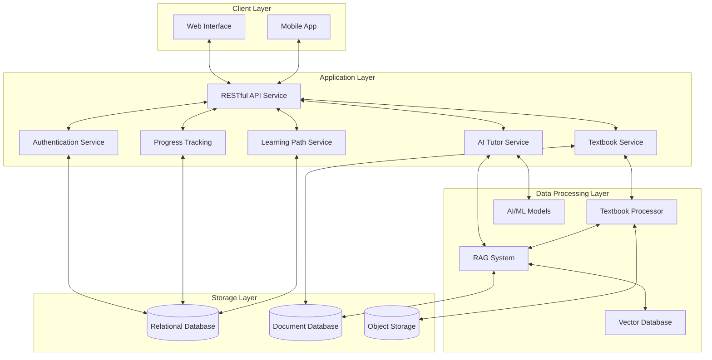
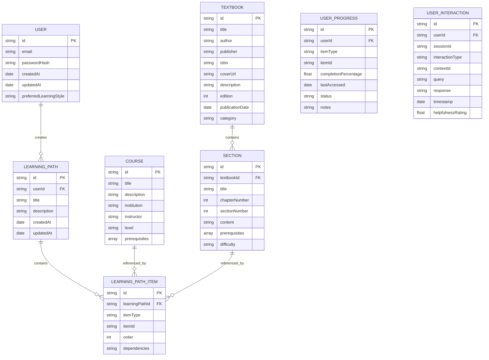
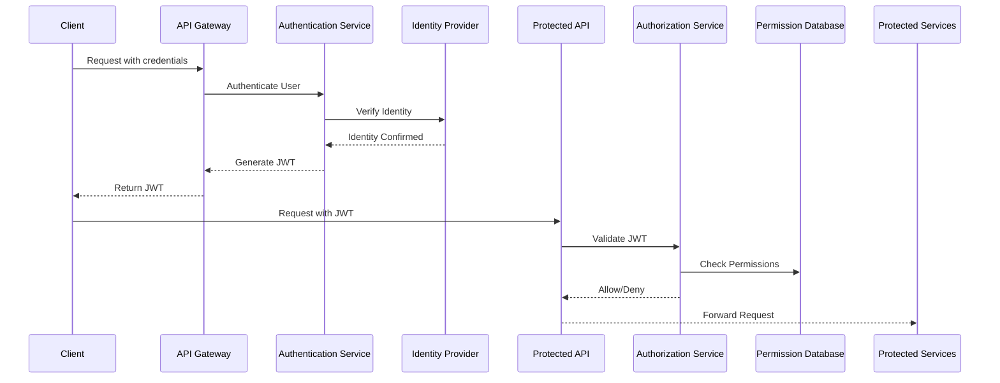
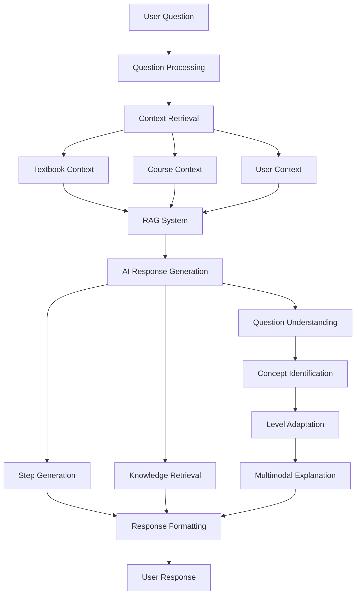
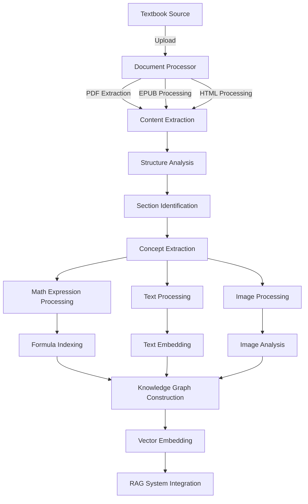
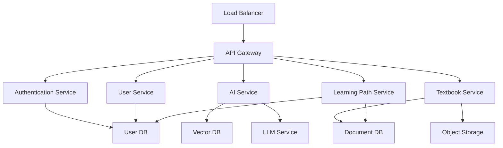
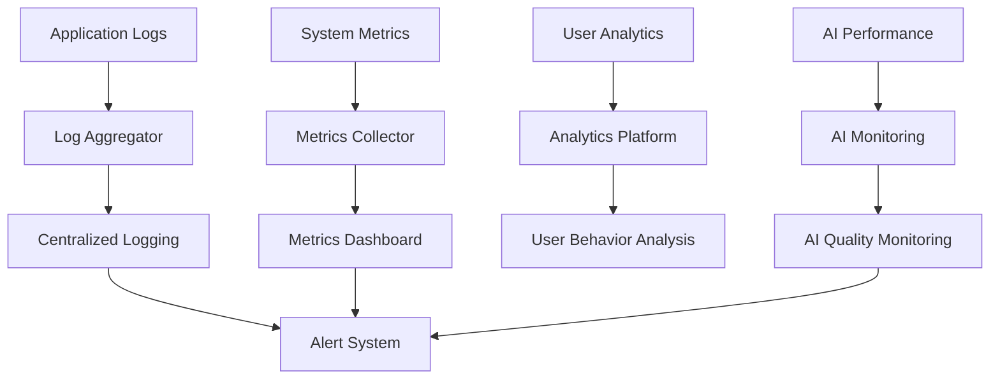

# YouSuckAtMath.com System Architecture

This document outlines the system architecture for YouSuckAtMath.com based on the specifications in the Product Requirements Document (PRD).

## Table of Contents
- [Architecture Overview](#architecture-overview)
- [Component Descriptions](#component-descriptions)
- [Data Model](#data-model)
- [API Design](#api-design)
- [Authentication & Security](#authentication--security)
- [AI Integration](#ai-integration)
- [Deployment Architecture](#deployment-architecture)

## Architecture Overview

YouSuckAtMath.com is built using a multi-layered architecture to ensure scalability, maintainability, and performance. The system consists of the following layers:

```
Client Layer → Application Layer → Data Processing Layer → Storage Layer
```

### System Architecture Diagram



## Component Descriptions

### Client Layer
- **Web Interface**: Progressive Web App (PWA) built with React, providing responsive UI for all devices
- **Mobile App**: Native or hybrid mobile application for iOS and Android (planned for Phase 3)

### Application Layer
- **RESTful API Service**: Core backend service handling client requests and orchestrating other services
- **Authentication Service**: Manages user authentication, authorization, and session management
- **AI Tutor Service**: Provides AI-powered tutoring, question answering, and problem-solving assistance
- **Textbook Service**: Handles textbook metadata, content retrieval, and search
- **Learning Path Service**: Manages creation, retrieval, and progression of learning paths
- **Progress Tracking**: Monitors and reports user progress through textbooks and learning paths

### Data Processing Layer
- **Textbook Processor**: Ingests, parses, and structures textbook content for use in the platform
- **RAG System**: Retrieval-Augmented Generation system for context-aware AI responses
- **Vector Database**: Stores embeddings for semantic search and retrieval
- **AI/ML Models**: Machine learning models for tutoring, content analysis, and personalization

### Storage Layer
- **Relational Database**: Stores structured data (users, progress, learning paths)
- **Document Database**: Stores semi-structured data (textbook content, questions, solutions)
- **Object Storage**: Stores binary files (images, PDFs, original textbooks)

## Data Model

The core entities in the system and their relationships:



## API Design

The platform uses a RESTful API design with the following major endpoints:

### Authentication API
- `POST /api/auth/register`
- `POST /api/auth/login`
- `POST /api/auth/refresh`
- `POST /api/auth/logout`

### User API
- `GET /api/users/:id`
- `PUT /api/users/:id`
- `GET /api/users/:id/progress`

### Textbook API
- `GET /api/textbooks`
- `GET /api/textbooks/:id`
- `GET /api/textbooks/:id/sections`
- `GET /api/textbooks/:id/sections/:sectionId`

### Learning Path API
- `GET /api/learning-paths`
- `POST /api/learning-paths`
- `GET /api/learning-paths/:id`
- `PUT /api/learning-paths/:id`
- `DELETE /api/learning-paths/:id`
- `GET /api/learning-paths/:id/items`

### AI Tutor API
- `POST /api/ai/question` - Ask a question
- `POST /api/ai/solve` - Solve a problem
- `POST /api/ai/explain` - Explain a concept
- `POST /api/ai/feedback` - Get feedback on a solution

## Authentication & Security



Security features:
- JWT-based authentication
- Role-based access control (RBAC)
- Data encryption at rest and in transit
- API rate limiting
- OAuth 2.0 support for third-party integrations
- GDPR and COPPA compliance measures
- Regular security audits and penetration testing

## AI Integration

### AI Tutor Workflow



### Textbook Processing Pipeline



## Deployment Architecture

Production deployment uses containerized microservices for scalability and maintainability:



### Development & Staging Environments

- Local development environment using Docker Compose
- CI/CD pipeline with automated testing
- Staging environment that mirrors production
- Blue-green deployment strategy for zero-downtime updates

### Monitoring & Logging



This architecture provides a solid foundation for YouSuckAtMath.com, allowing for both current MVP needs and future scalability as the platform grows.
